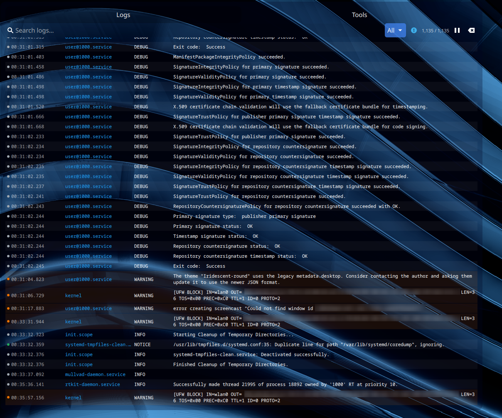
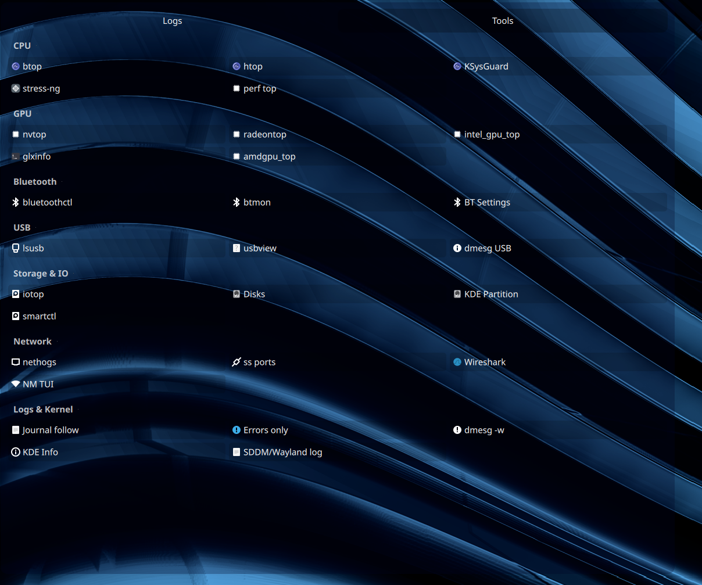
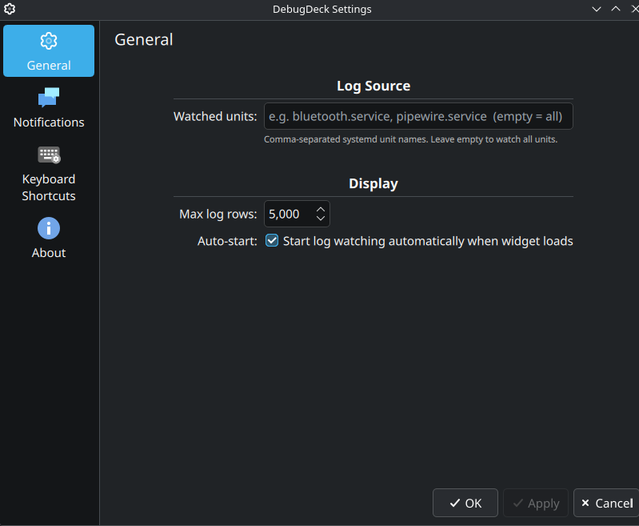
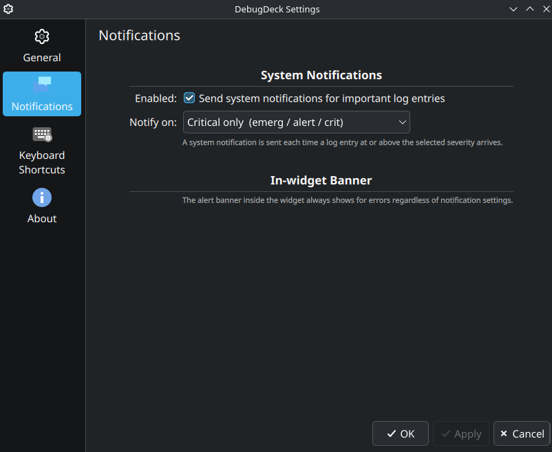
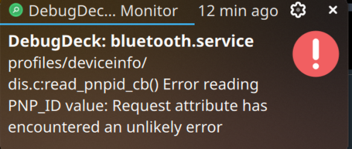

# DebugDeck

A KDE Plasma 6 panel widget that gives you a real-time systemd journal monitor, log filtering, desktop notifications for errors, and a one-click launcher for common debugging tools — all from your taskbar.



## Features

- **Live journal tail** — streams entries from `journald` in real time, coloured by severity
- **Filtering** — search by text, filter by priority (All / Warning+ / Error+ / Critical), or pin a specific systemd unit
- **Desktop notifications** — sends KDE system notifications when errors or warnings arrive; fully configurable
- **Alert banner** — an in-widget slide-in banner highlights the latest error for 8 seconds
- **Compact badge** — the panel icon shows a live error/warning count so you always know something needs attention
- **Tools tab** — one-click launchers for CPU, GPU, Bluetooth, USB, storage, network, and log utilities (btop, htop, nvtop, Wireshark, and more)



## Screenshots

| Config – General | Config – Notifications | Example Notification |
|---|---|---|
|  |  |  |

## Requirements

| Dependency | Version |
|---|---|
| KDE Plasma | 6.0+ |
| Qt | 6.x |
| KDE Frameworks | 6.x (CoreAddons, I18n, Notifications) |
| `libsystemd` | optional — enables native journal fd; falls back to `journalctl` subprocess without it |

## Installation

### From KDE Store

Search for **DebugDeck** in *System Settings → Plasma Widgets → Get New Widgets*, or visit the [KDE Store page](#).

### Manual build from source

```bash
git clone https://github.com/ryansinn/debugdeck.git
cd debugdeck
cmake -B build -DCMAKE_BUILD_TYPE=Release
cmake --build build
cmake --install build   # may need sudo
```

Then right-click your panel → *Add Widgets* → search **DebugDeck**.

## Configuration

| Setting | Default | Description |
|---|---|---|
| Watched units | *(empty = all)* | Comma-separated systemd unit names to filter the journal stream |
| Max log rows | 5000 | Maximum entries kept in memory |
| Auto-start | on | Begin watching the journal as soon as the widget loads |
| Notifications | on | Send KDE system notifications for important log entries |
| Notify on | Errors+ | Minimum severity that triggers a notification |

## License

GPL-2.0-or-later — see [LICENSE](LICENSE).
